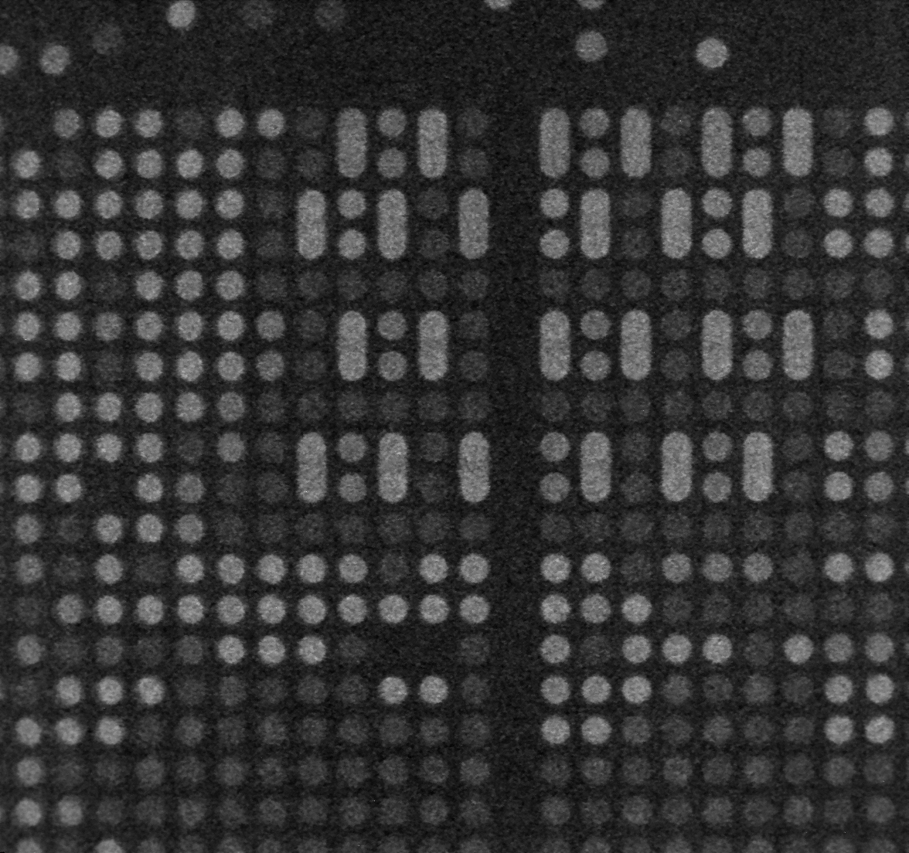
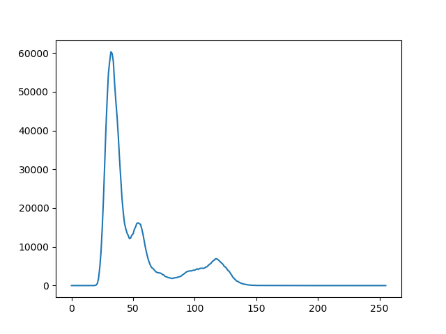
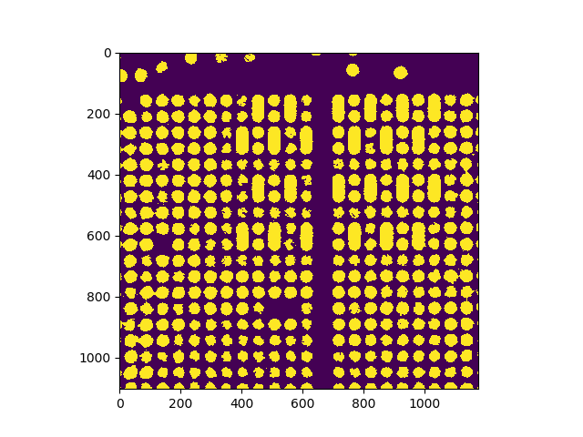
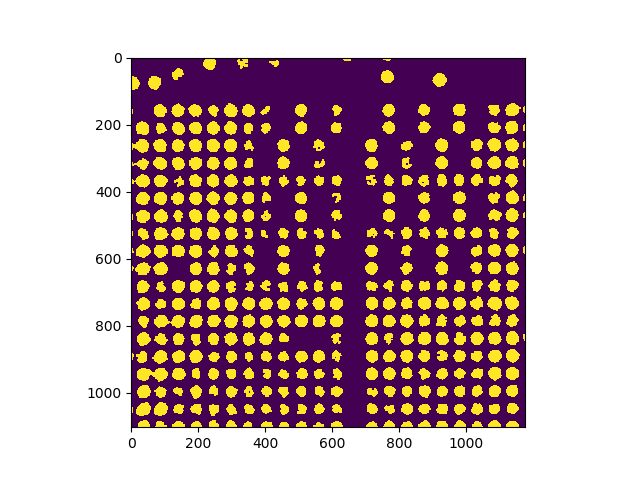
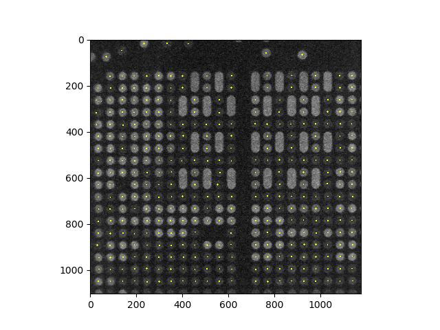

# Circles extraction and draw its centre points

## Requiremnts



Extract white and gray circles in the image above, and draw the centre point of every circle.

## Implement
### Dependencies
* Python 3.6
* opencv-python 3.4
* numpy
* matplotlib

### Steps
#### 1. read source image as 8UC1 type and denoising
#### 2. binary processing accoding to the histogram



According to the histogram, we know that the image has three main colors: balck background, gray blocks and white blocks. Then through binary processing, we can separate background and blocks:



### 3. delete ellipse blocks

The height-width ratio of ellipse blocks is different with circle blocks, we can leverage this character to delete ellipse blocks in images. Before delection we need to erode the image to reduce the connections of blocks, after delection we need to dilate the image.
(Erode -> delete ellipses -> dilate). The processed image:



We can see that all ellipse blocks have been deleted, and none of circle blocks were deleted by mistake.

### 4. get the centre points

The centre point of a circle is the middle point of the smallest rectangle that override the circle. We can leverage this character to get the centre point coordinates of circles and draw these points in original image.
The final image:




## Some opencv functions:

denoise: 
```python
denoised_img = cv2.fastNlMeansDenoising(source_img, None, 10)
```
histogram: 
```python
hist = cv2.calcHist([denoised_img], [0], None, [256], [0, 256])
```
binarizarion: 
```python
ret, thresh_img = cv2.threshold(denoised_img, 46, 255, cv2.THRESH_BINARY)
```
erode: 
```python
erode_img = cv2.erode(thresh_img, np.ones((3, 3), np.uint8), iterations=3)
```
find contours: 
```python
contours_img, contours, hierarchy = cv2.findContours(erode_img, cv2.RETR_EXTERNAL, cv2.CHAIN_APPROX_SIMPLE)
```
dilate: 
```python
dilate_img = cv2.dilate(contours_img, np.ones((3, 3), np.uint8), iterations=2)
```
draw circle: 
```python
cv2.circle(source_img1, item, 3, (255, 255, 0), -1)
```
